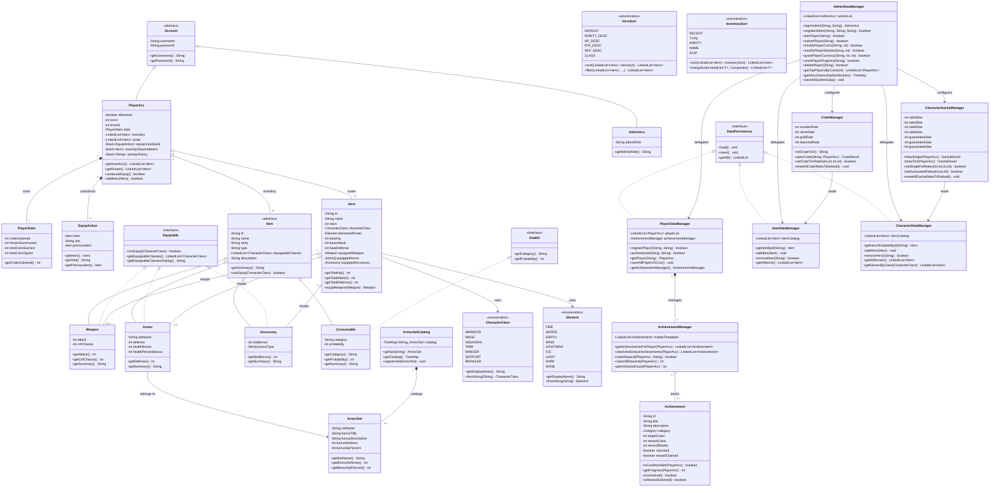

# Cratetopia – UML Class Diagram

```mermaid
classDiagram
    direction TB

    class Account {
        <<abstract>>
        -String username
        -String password
        +getUsername() String
        +getPassword() String
    }

    class PlayerAcc {
        -boolean isBanned
        -int coins
        -int shards
        -PlayerStats stats
        -LinkedList~Item~ inventory
        -LinkedList~Hero~ roster
        -Stack~EquipAction~ equipUndoStack
        -Stack~Item~ recentlyObtainedItems
        -Stack~String~ activityHistory
        +getInventory() LinkedList~Item~
        +getRoster() LinkedList~Hero~
        +undoLastEquip() boolean
        +addHero(Hero) boolean
    }

    class AdminAcc {
        -String adminRole
        +getAdminRole() String
    }

    class PlayerStats {
        -int cratesOpened
        -int heroesSummoned
        -int totalCoinsEarned
        -int totalCoinsSpent
        +getCratesOpened() int
    }

    class EquipAction {
        -Hero hero
        -String slot
        -Item previousItem
        +getHero() Hero
        +getSlot() String
        +getPreviousItem() Item
    }

    class Equipable {
        <<interface>>
        +canEquip(CharacterClass) boolean
        +getEquippableClasses() LinkedList~CharacterClass~
        +getEquippableClassesDisplay() String
    }

    class Usable {
        <<interface>>
        +getCategory() String
        +getProbability() int
    }

    class DataPersistence {
        <<interface>>
        +load() void
        +save() void
        +getAll() LinkedList
    }

    class Item {
        <<abstract>>
        -String id
        -String name
        -String rarity
        -String type
        -LinkedList~CharacterClass~ equippableClasses
        -String description
        +getSummary()* String
        +canEquip(CharacterClass) boolean
    }

    class Weapon {
        -int attack
        -int critChance
        +getAttack() int
        +getCritChance() int
        +getSummary() String
    }

    class Armor {
        -String setName
        -int defense
        -int healthBonus
        -int healthPercentBonus
        +getDefense() int
        +getSummary() String
    }

    class Accessory {
        -int statBonus
        -String bonusType
        +getStatBonus() int
        +getSummary() String
    }

    class Consumable {
        -String category
        -int probability
        +getCategory() String
        +getProbability() int
        +getSummary() String
    }

    class ArmorSet {
        -String setName
        -String bonusTitle
        -String bonusDescription
        -int bonusDefense
        -int bonusHpPercent
        +getSetName() String
        +getBonusDefense() int
        +getBonusHpPercent() int
    }

    class ArmorSetCatalog {
        -TreeMap~String_ArmorSet~ catalog
        +getSet(String) ArmorSet
        +getCatalog() TreeMap
        +registerSet(ArmorSet) void
    }

    class Hero {
        -String id
        -String name
        -int stars
        -CharacterClass characterClass
        -Element elementalPower
        -int baseHp
        -int baseAttack
        -int baseDefense
        -Weapon equippedWeapon
        -Armor[] equippedArmor
        -Accessory equippedAccessory
        +getTotalHp() int
        +getTotalAttack() int
        +getTotalDefense() int
        +equipWeapon(Weapon) Weapon
    }

    class CharacterClass {
        <<enumeration>>
        WARRIOR
        MAGE
        ASSASSIN
        TANK
        RANGER
        SUPPORT
        BRAWLER
        +getDisplayName() String
        +fromString(String) CharacterClass
    }

    class Element {
        <<enumeration>>
        FIRE
        WATER
        EARTH
        WIND
        LIGHTNING
        ICE
        LIGHT
        DARK
        NONE
        +getDisplayName() String
        +fromString(String) Element
    }

    class HeroSort {
        <<enumeration>>
        DEFAULT
        RARITY_DESC
        HP_DESC
        ATK_DESC
        DEF_DESC
        CLASS
        +sort(LinkedList~Hero~, HeroSort) LinkedList~Hero~
        +filter(LinkedList~Hero~, ...) LinkedList~Hero~
    }

    class InventorySort {
        <<enumeration>>
        RECENT
        TYPE
        RARITY
        NAME
        STAT
        +sort(LinkedList~Item~, InventorySort) LinkedList~Item~
        +mergeSort(LinkedList~T~, Comparator) LinkedList~T~
    }

    class Achievement {
        -String id
        -String title
        -String description
        -Category category
        -int targetCount
        -int rewardCoins
        -int rewardShards
        -boolean unlocked
        -boolean rewardClaimed
        +isConditionMet(PlayerAcc) boolean
        +getProgress(PlayerAcc) int
        +isUnlocked() boolean
        +isRewardClaimed() boolean
    }

    class AchievementManager {
        -LinkedList~Achievement~ masterTemplates
        +getAchievementsForPlayer(PlayerAcc) LinkedList~Achievement~
        +checkAndUnlockAchievements(PlayerAcc) LinkedList~Achievement~
        +claimReward(PlayerAcc, String) boolean
        +claimAllRewards(PlayerAcc) int
        +getUnlockedCount(PlayerAcc) int
    }

    class CrateManager {
        -int woodenRate
        -int silverRate
        -int goldRate
        -int diamondRate
        +rollCrateTier() String
        +openCrate(String, PlayerAcc) CrateResult
        +setCrateTierRates(int,int,int,int) boolean
        +resetAllCrateRatesToDefault() void
    }

    class CharacterGachaManager {
        -int rate3Star
        -int rate4Star
        -int rate5Star
        -int rate6Star
        -int guarantee4Star
        -int guarantee5Star
        -int guarantee6Star
        +drawSingle(PlayerAcc) GachaResult
        +drawTen(PlayerAcc) GachaResult
        +setSinglePullRates(int,int,int,int) boolean
        +setGuaranteeRates(int,int,int) boolean
        +resetAllGachaRatesToDefault() void
    }

    class PlayerDataManager {
        -LinkedList~PlayerAcc~ playerList
        -AchievementManager achievementManager
        +registerPlayer(String, String) boolean
        +authenticate(String, String) boolean
        +getPlayer(String) PlayerAcc
        +saveAllPlayersToCsv() void
        +getAchievementManager() AchievementManager
    }

    class ItemDataManager {
        -LinkedList~Item~ itemCatalog
        +getItemById(String) Item
        +addItem(Item) void
        +removeItem(String) boolean
        +getAllItems() LinkedList~Item~
    }

    class CharacterDataManager {
        -LinkedList~Hero~ heroCatalog
        +getHeroTemplateById(String) Hero
        +addHero(Hero) void
        +removeHero(String) boolean
        +getAllHeroes() LinkedList~Hero~
        +getHeroesByClass(CharacterClass) LinkedList~Hero~
    }

    class AdminDataManager {
        -LinkedList~AdminAcc~ adminList
        +loginAdmin(String, String) AdminAcc
        +registerAdmin(String, String, String) boolean
        +banPlayer(String) boolean
        +unbanPlayer(String) boolean
        +modifyPlayerCoins(String, int) boolean
        +modifyPlayerShards(String, int) boolean
        +grantPlayerCurrency(String, int, int) boolean
        +resetPlayerProgress(String) boolean
        +deletePlayer(String) boolean
        +getTopPlayersByCoins(int) LinkedList~PlayerAcc~
        +getHeroOwnershipDistribution() TreeMap
        +saveAllSystemData() void
    }

    %% ── Inheritance ──────────────────────────────────────────
    Account <|-- PlayerAcc
    Account <|-- AdminAcc
    Item <|-- Weapon
    Item <|-- Armor
    Item <|-- Accessory
    Item <|-- Consumable

    %% ── Interface Implementations ────────────────────────────
    Equipable <|.. Weapon
    Equipable <|.. Armor
    Equipable <|.. Accessory
    Usable <|.. Consumable
    DataPersistence <|.. PlayerDataManager
    DataPersistence <|.. ItemDataManager
    DataPersistence <|.. CharacterDataManager

    %% ── Compositions / Aggregations ──────────────────────────
    PlayerAcc "1" *-- "1" PlayerStats : owns
    PlayerAcc "1" *-- "1" EquipAction : undoStack
    PlayerAcc "1" o-- "0..*" Hero : roster
    PlayerAcc "1" o-- "0..*" Item : inventory
    Hero "1" o-- "0..1" Weapon : equips
    Hero "1" o-- "0..3" Armor : equips
    Hero "1" o-- "0..1" Accessory : equips
    Hero --> CharacterClass : uses
    Hero --> Element : uses
    Armor --> ArmorSet : belongs to
    ArmorSetCatalog "1" *-- "0..*" ArmorSet : catalogs

    %% ── Manager Relationships ────────────────────────────────
    PlayerDataManager "1" *-- "1" AchievementManager : manages
    AchievementManager "1" o-- "0..*" Achievement : tracks
    AdminDataManager --> PlayerDataManager : delegates
    AdminDataManager --> ItemDataManager : delegates
    AdminDataManager --> CharacterDataManager : delegates
    AdminDataManager --> CrateManager : configures
    AdminDataManager --> CharacterGachaManager : configures
    CrateManager --> ItemDataManager : reads
    CharacterGachaManager --> CharacterDataManager : reads
```
